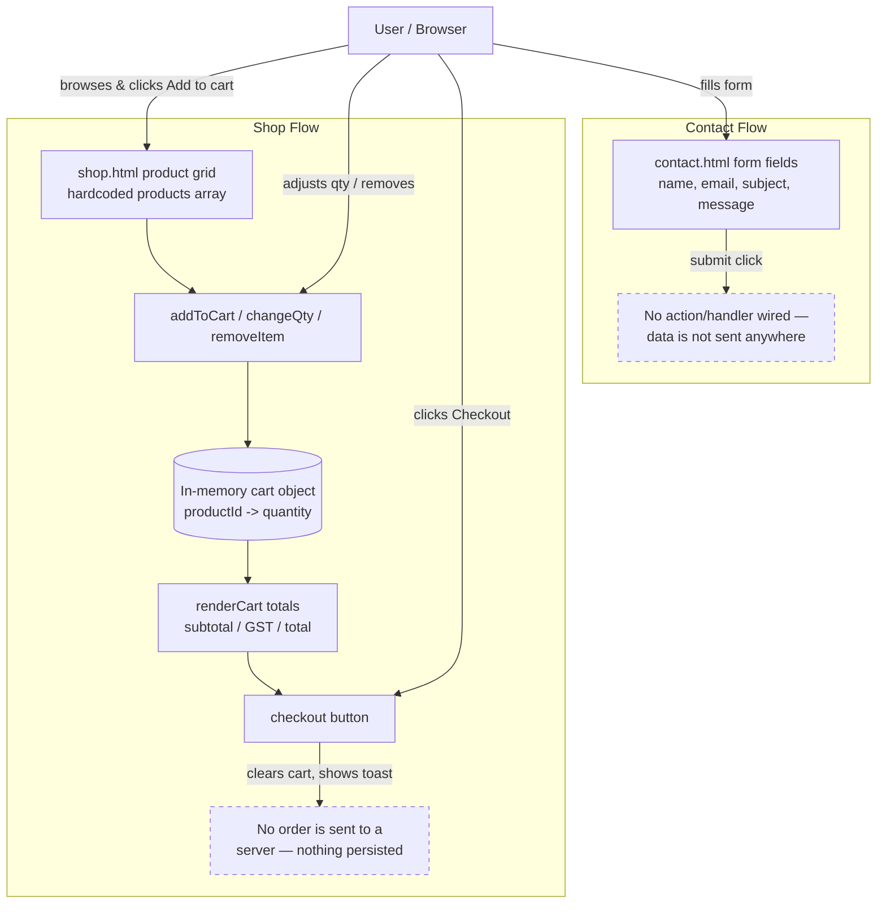

# Week 2 — Data Analysis

**Project:** Buildmart (Secure Retail System) — Capstone A
**Author:** Kalyan
**Scope:** `index.html`, `shop.html`, `contact.html`, `about.html` (current front-end-only implementation, no backend yet)

This document covers the three Week 2 deliverables: a data inventory, a data flow diagram, and a data risk analysis, based on the data actually collected and processed by the site today.

---

## 1. Data Inventory

| # | Data Element | Source (page/component) | Category | Sensitivity | Where it lives today | Persisted? |
|---|---------------|--------------------------|----------|--------------|------------------------|------------|
| 1 | First name | `contact.html` form | PII | Low–Medium | Browser DOM only (no `action`/handler wired up) | No |
| 2 | Last name | `contact.html` form | PII | Low–Medium | Browser DOM only | No |
| 3 | Email address | `contact.html` form | PII | Medium | Browser DOM only | No |
| 4 | Subject (enquiry type) | `contact.html` form | Non-PII (context) | Low | Browser DOM only | No |
| 5 | Message body | `contact.html` form | PII (may contain free text) | Medium | Browser DOM only | No |
| 6 | Search query | `shop.html` search box | Non-PII | Low | Browser DOM only (search is not wired to any logic yet) | No |
| 7 | Product catalogue (id, name, price, unit) | `shop.html` `products` array | Business data | Low | Hardcoded client-side JS | No (static) |
| 8 | Cart contents (`productId → quantity`) | `shop.html` `cart` object | Session/transactional | Low | In-memory JS variable, tab lifetime only | No |
| 9 | Order total at checkout | `shop.html` `checkout()` | Transactional | Low | Computed client-side, shown in a toast, then discarded | No |

**Notes:**
- There is currently no backend, database, cookies, or `localStorage` use anywhere in the codebase — all state lives in memory and is lost on page refresh.
- The contact form has no `action`, `method`, or JS submit handler, so form data is not actually transmitted anywhere yet despite the "🔒 Your information is safe with us" note in `contact.html`.
- No authentication, accounts, or payment data exist in the current build.

---

## 2. Data Flow Diagram

**Reading the diagram:** every data flow in the current site begins and ends inside the user's browser tab. There is no network egress, no external API, no analytics/tracking script, and no server component to diagram yet. The dashed boxes mark the two points (contact submit, checkout) where a real "Secure Retail System" would need a backend flow — those are the seams the team should design around next.

---

## 3. Data Risk Analysis

| # | Risk | Where | Likelihood | Impact | Notes / Mitigation |
|---|------|-------|------------|--------|----------------------|
| 1 | Contact form collects PII (name, email, message) with no server, no validation, and no sanitization | `contact.html` | High (as soon as a backend is added) | Medium–High | Add server-side validation + output encoding before rendering message content anywhere (stored/reflected XSS risk); never trust client input. |
| 2 | Misleading privacy claim — "Your information is safe with us" is shown even though nothing is transmitted or protected yet | `contact.html` | Medium | Medium | Either wire the form to a real, secured endpoint or remove the claim until it's true; add a real privacy notice once a backend exists. |
| 3 | No CSRF protection planned for future form submission | `contact.html` | Medium (future) | Medium | Use CSRF tokens / SameSite cookies once a backend handler is added. |
| 4 | No rate limiting / CAPTCHA on contact form | `contact.html` | Medium (future) | Low–Medium | Add rate limiting and bot protection before going live to prevent spam/abuse. |
| 5 | Client-side price/catalogue data can be viewed and tampered with via DevTools; checkout total is computed entirely client-side | `shop.html` | High | High (if a backend is added) | Any real checkout must recompute prices/totals server-side — never trust the client-submitted total. |
| 6 | Quantity cap logic references an undefined variable (`cast[id]` instead of `cart[id]`) in `changeQty()`, so the intended 20-unit cap silently fails | `shop.html:327` | High (bug, not exploit) | Low | Data-integrity bug, not a security hole today, but should be fixed — flagged for the team as a code-quality/reliability issue. |
| 7 | No HTTPS/TLS requirement documented for when data starts leaving the browser | Project-wide | Medium (future) | High | Document and enforce TLS for all future form submissions and API calls carrying PII. |
| 8 | Cart/session data has no confidentiality requirement today (product IDs/quantities only), but is fully volatile — refreshing the page silently discards a customer's cart | `shop.html` | High | Low (UX, not security) | Not a security risk, but worth noting as a data-availability gap for a later sprint (e.g., `localStorage` cart persistence). |

**Overall assessment:** the current build is a static front-end demo with no real attack surface for data exfiltration, because no data actually leaves the browser. The risks above are therefore forward-looking — they describe what must be addressed *before* the contact form and checkout flow are connected to a real backend, which is the next logical step toward the "Secure Retail System" goal stated in the README.

---

## 4. Review Comments & Improvements Log

Use this section to record team review feedback on this document and track resulting action items.

| Date | Reviewer | Comment | Resulting Action |
|------|----------|---------|-------------------|
| 2026-09-16 | Kalyan (author) | Initial draft based on current `main` branch (no backend yet); flagged the `cast[id]` typo bug found while reviewing `shop.html` for the risk analysis | Opened as PR for team review; typo bug to be filed as a separate issue/fix by whoever owns quantity update |

